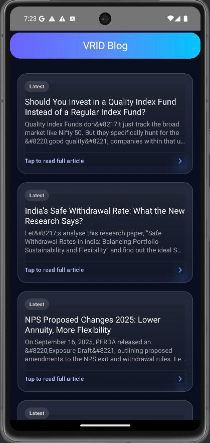

# vridBlogApp

A modern, native Android application built with Jetpack Compose that provides a clean and intuitive interface for browsing blog posts. This project serves as a practical example of modern Android development techniques, showcasing a robust architecture and a polished user experience.

## ✨ Features

- **Dynamic Blog Feed:** Fetches and displays a list of the latest blog posts from a remote API.
- **Clean, Modern UI:** A beautifully designed user interface built entirely with Jetpack Compose, featuring a dark mode theme.
- **Detailed View:** Tap on any blog post to navigate to a detailed view to read the full article.
- **Scalable Architecture:** Built on a solid MVVM architecture, making the codebase easy to maintain and test.

## 🚀 Tech Stack

- **UI:** [Jetpack Compose](https://developer.android.com/jetpack/compose) for building a native UI with a declarative approach.
- **Architecture:** MVVM (Model-View-ViewModel) to ensure a clean separation of business logic from the UI.
- **Asynchronous Programming:** [Kotlin Coroutines](https://kotlinlang.org/docs/coroutines-overview.html) for managing background threads and handling asynchronous operations efficiently.
- **Navigation:** [Jetpack Navigation Compose](https://developer.android.com/jetpack/compose/navigation) for navigating between screens in a type-safe manner.
- **Networking:** [Retrofit](https://square.github.io/retrofit/) & [OkHttp](https://square.github.io/okhttp/) for making efficient and type-safe network requests to the blog's API.
- **JSON Parsing:** [Moshi](https://github.com/square/moshi) for fast and reliable JSON serialization, with compile-time code generation via [KSP](https://kotlinlang.org/docs/ksp-overview.html).

## 🏗️ Architecture (MVVM)

This project follows the Model-View-ViewModel (MVVM) architectural pattern to promote a scalable and testable codebase.

```
      +----------------+      +----------------+      +----------------+
      |      View      |      |   ViewModel    |      |      Model     |
      | (Compose UI)   |      | (Business Logic) |      | (Data Layer)   |
      +-------+--------+      +--------+-------+      +--------+-------+
              |                        |                       |
              | observes State &       |                       |
              | sends User Events      +---------------------> |
              |                        |                       |
              <----------------------+                       |
               (updates UI with State) |                       |
                                       |                       |
                                       | fetches/updates Data  |
                                       +---------------------> | (Repository)   |
                                                               |
                                       <---------------------+                       
                                        (provides Data)      |
                                                               |
```

-   **View (UI Layer):** Built with Jetpack Compose. It observes state changes from the `ViewModel` and sends user events to it.
-   **ViewModel:** Contains the business logic for the screen. It receives events from the View and interacts with the Model (Repository) to fetch or update data.
-   **Model (Data Layer):** Manages the application's data using the Repository pattern. It acts as the single source of truth, abstracting the data sources (API, database) from the rest of the app.

## 📸 Screenshots

Here are some screenshots of the app in action:

| Blog List | Blog Detail |
| :---: | :---: |
|  |  |

## 🛠️ How to Build

To build and run this project locally, you will need a recent version of Android Studio.

1.  **Clone the repository:**
    ```sh
    git clone https://github.com/nakulcharak002/vridBlog
    ```
2.  **Open in Android Studio:** Open the cloned project in Android Studio.
3.  **Sync Gradle:** Allow Gradle to sync and download all the required dependencies.
4.  **Run the app:** Build and run the app on an emulator or a physical device.

*Note: This project is currently a work in progress. More features and improvements are planned for the future.*
